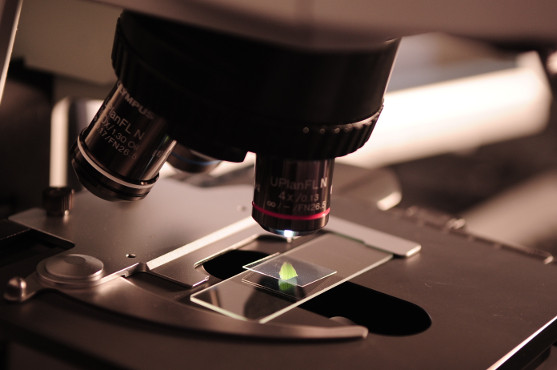

Now let's have a look at some images. By default, all images will show with a thin border, and will be left aligned with a maximum width of 100% of the available space. In addition, for smaller images there is an option to scale images so that they can occupy 100% of the available space.

In markdown, images are added in a similar way to URLs, except that they are preceeded with `!`

For example...

## Small image
This is a 557 x 370 pixel image.

```

```


## Small image with full width option
This is the same image as above, but with the `img-full-width` class appended.

```

{: .img-full-width}
```


{: .img-full-width}

## Big image
This is a 6000 x 4000 pixel image.

```

```


